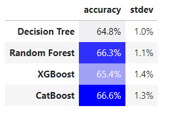

# О датасете

##### ссылка: https://www.kaggle.com/datasets/prachi13/customer-analytics
## Компания, которая продает электронику онлайн, хочет найти различные зависимости и закономерности в базе данных своих клиентов

### Датасет содержит 12 переменных и почти 11000 строк с данными

### Переменные: 

#### ID: Уникальный ID клиента.

#### Warehouse block: Склад компании поделен на блоки A,B,C,D,E. 

#### Mode of shipment: Тип доставки: по воздуху, воде или суше

#### Customer care calls: Количество обращений по поводу доставки 

#### Customer rating: Рейтинг покупателя от 1 до 5

#### Cost of the product: Стоимость товара

#### Prior purchases: Число предыдущих покупок

#### Product importance: Категория, которую присвоила компания каждому товару
#### Gender: Пол клиента.
#### Discount offered: Размер скидки на конкретный товар

#### Weight in gms: Вес посылки в граммах

#### Reached on time: 1, если товар прибыл вовремя и 0, если нет

# Результат выполнения алгоритмов ( точность и отклонение )
